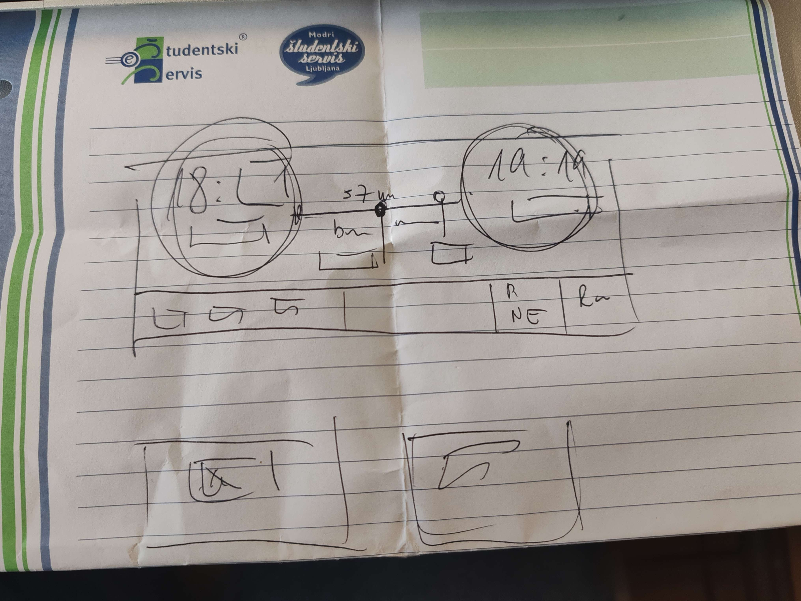

# Kritike in nasveti za izboljšavo kartomata Slovenskih železnic

Ta dokument povzema povratne informacije, kritike in predloge drugih skupin, pridobljene med predstavitvami prototipov ter diskusijami. Namen dokumenta je analizirati prejete komentarje, izpostaviti ključne težave in opisati možne smeri izboljšav za prihodnje iteracije kartomata.

---

## 1. Povzetek prejetih kritik

V nadaljevanju so zbrane glavne pripombe, ki so jih druge skupine izpostavile pri ocenjevanju našega kartomata:

### **1.1 Skupina 2**

- Dodati možnost spreminjanja števila potnikov na strani za "Hitri nakup".

- Dodati seznam dodatkov na strani za "Hitri nakup", kjer bi uporabnik lahko izbral želene dodatke.

- Omogočiti hitre spremembe na strani "Povzetek nakupa".

- Povečati preglednost in jasneje predstaviti podatke na strani za "Hitri nakup".

- Na strani "Strinjam se s pogoji" namesto ikone za zapiranje (X) dodati gumb "Ne strinjam se s pogoji" za boljšo preglednost.

- Dodati informacijo o tem, kdaj prihaja prvi naslednji vlak, na stran za "Hitri nakup".
 

### **1.2 Skupina 17**

- Povečati preglednost in jasneje predstaviti podatke na strani "Hitri nakup".

- Na začetno stran kartomata dodati možnost "Kako uporabljati kartomat", ki bi na kratko predstavila postopek nakupa vozovnice.

- Na začetni strani dodati jasno povezavo, da se mora uporabnik ob skeniranju QR kode še strinjati s pogoji za prodajo vozovnice.

- Na stran "Izberite vrsto plačila" dodati slikovni prikaz kartice in gotovine.

### **1.3 Predlogi in pripombe asistenta**

- Na strani "Hitri nakup" izboljšati ločevanje med možnostjo in njeno vrednostjo (npr. datum: 11.10.2025).

- Na strani "Hitri nakup" dodati možnost izbire prvega, drugega ali tretjega naslednjega vlaka.

- Dodati možnost spreminjanja števila potnikov na strani "Hitri nakup".

- Na straneh "Hitri nakup" in "Nakup vozovnice" preprečiti nadaljevanje, če uporabnik ne izbere izhodne postaje.

- Dodati povratni prikaz izbrane izhodne postaje na straneh "Hitri nakup" in "Nakup vozovnice".

- Zagotoviti ustrezen zapis datuma na straneh "Hitri nakup" in "Nakup vozovnice".

- Pripravi ustrezno tipkovnico z velikimi tiskanimi črkami, številkami in brez odvečnih gumbov.

- Posodobiti prikaz podatkov na strani "Povzetek nakupa" za bolj enostavno in hitro uporabo (primer: slika 1.1).

**slika 1.1:** Ideja za izboljšano stran "Povzetek nakupa".

- Dodati možnost pregleda pogojev na strani "Strinjam se s pogoji".

- Dodati besedilo za plačilo s kartico: "Sledite navodilom na terminalu." ter za plačilo z gotovino: "Prosim, vstavite denar." na strani "Izberite vrsto plačila".

- Posodobiti prikaz potnikov tako, da podpira več vrst uporabnikov (odrasel, otrok od 6 do 15 let, otrok do 6 let) ter omogoča pregled popustov, kjer so ti na voljo.

- Dodati možnost vertikalnega pomikanja po seznamu vlakov za boljši prikaz večjega števila vlakov na strani "Izbetite vozovnico".

- Posodobiti barve označb tipov vlakov, tako da ima vsaka kategorija svojo barvo na strani "Izbetite vozovnico".

- Posodobiti filtriranje seznama vlakov na strani "Izbetite vozovnico", z dodatno možnostjo "kolo", saj se ta podatek izbere vnaprej in mora seznam prikazati samo vlake, ki omogočajo prevoz koles.

## 2. Predlogi za izboljšave

Na podlagi zgoraj navedenih kritik so oblikovani naslednji predlogi:

- nekaj

- nekaj

### **2.1 Izboljšave**

- nekaj

- nekaj

## 3. Zaključek

Dokument služi kot osnova za naslednjo fazo razvoja, kjer bomo kritike skušali čim bolj učinkovito vključiti v izboljšano različico kartomata.
